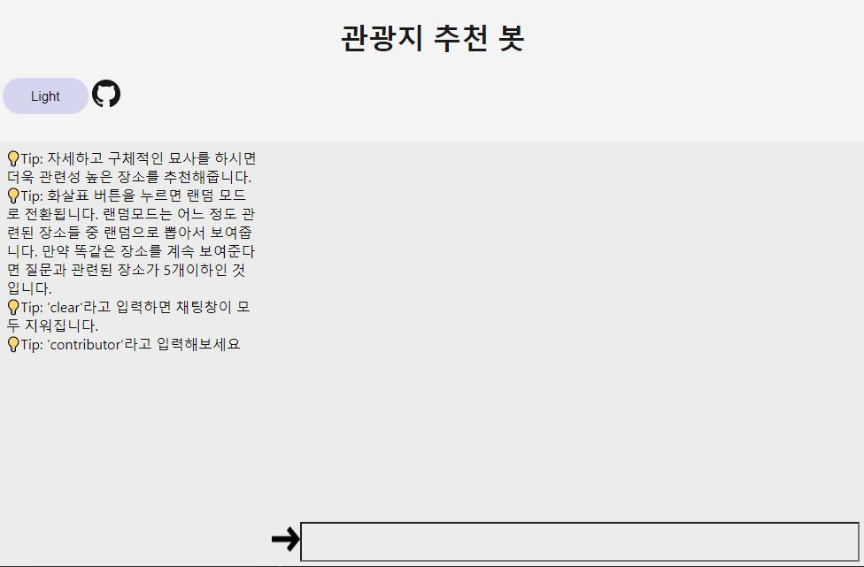
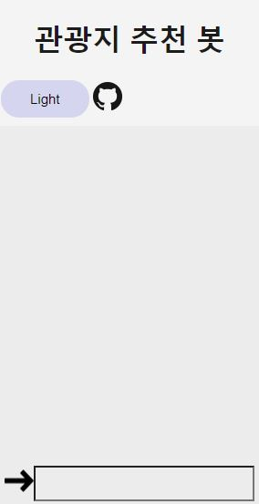

# 원하는 관광지를 추천해주는 QA 봇

원하는 여행을 문장으로 표현해주면 관련성이 높은 관광지들을 정렬해서 보여줍니다.
예를 들어 `여름 관광지`라고 입력하면 `부산 해운대 해수욕장`을 보여주고
좀 더 복잡하게 `서울에서 친구들이랑 놀기 좋은 곳`이라고 검색하면 `서울 롯데월드`를 보여주는 방식의 시스템입니다.

## 서버 실행 방법

먼저 웹어플리케이션을 빌드해야합니다.

1. webfront 로 이동
    ```
    cd webfront
    ```
2. npm으로 패키지 설치
    ```
    npm install
    ```
3. `.env`파일을 생성해서 안에 다음 내용을 넣고 저장
    ```
    BUILD_PATH='../build'
    ```
4. 어플리케이션 빌드
    ```
    npm run build
    ```

다음으로는 서버를 실행시킵니다.

```
python server.py
```

<br/>
<br/>

## 실행 화면

- PC화면



- 모바일 화면



- 다크모드 화면

